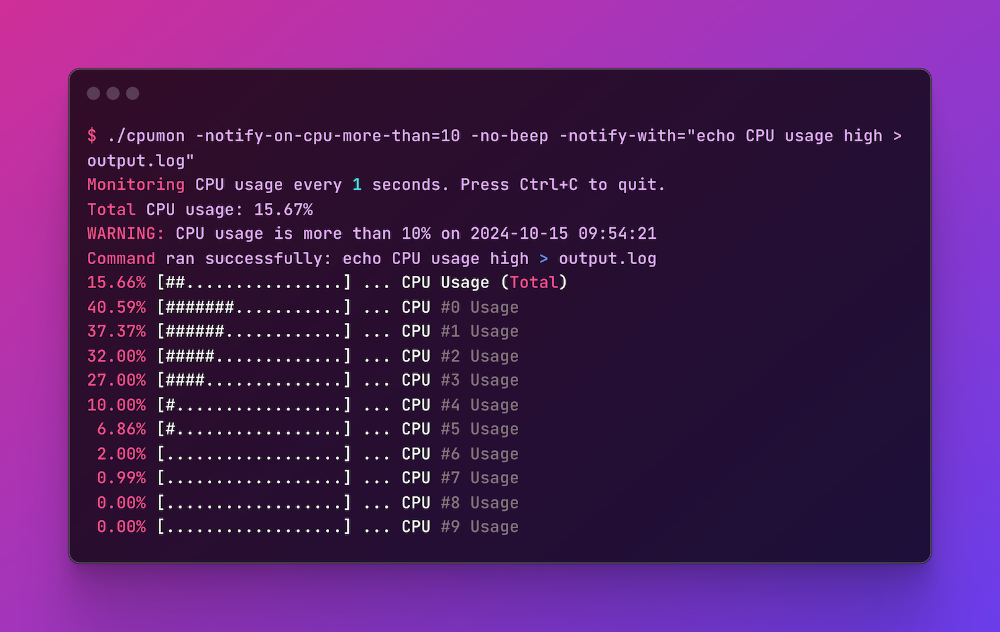

# cpumon




`cpumon` is a utility designed to monitor your CPU usage and provide notifications through beeps and/or by executing a specified command.

For example, it can be useful for sending an email by triggering an API with a `curl` command that corresponds to this action.

> Interested in monitoring your system memory too? Check out [memmon](https://github.com/tonywei92/memmon)!

## Download

Head to [release](https://github.com/tonywei92/cpumon/releases/latest) page, choose the appropriate binary for your operating system and architecture from the available options, and extract.

## Usage

Example:

```sh
# call `echo` command if CPU is more than 80% usage
cpumon -notify-on-cpu-more-than=80 -no-beep -notify-with="echo CPU usage high > output.log"
```

### Flags

- `-interval`: Interval in seconds (default: 1)
- `-single`: Monitor single CPU (default: true)
- `-notify-on-cpu-more-than`: Notify when CPU usage exceeds this percentage (default: 0)
- `-no-beep`: Disable beep notification (default: false)
- `-notify-with`: Command to run on notification (default: "")

## Changelog

For a detailed history of changes, please refer to the [CHANGELOG.md](CHANGELOG.md) file.

## Contributing

Thank you for considering contributing to `cpumon`! We welcome contributions in the form of bug reports, feature requests, and pull requests. Please see [CONTRIBUTING.md](CONTRIBUTING.md) for guidelines on how to contribute to this project.

## License

This project is licensed under the MIT License. See the [LICENSE](LICENSE) file for details.
